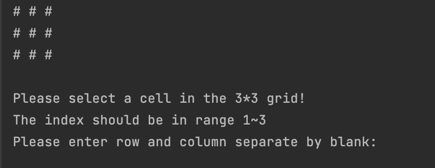
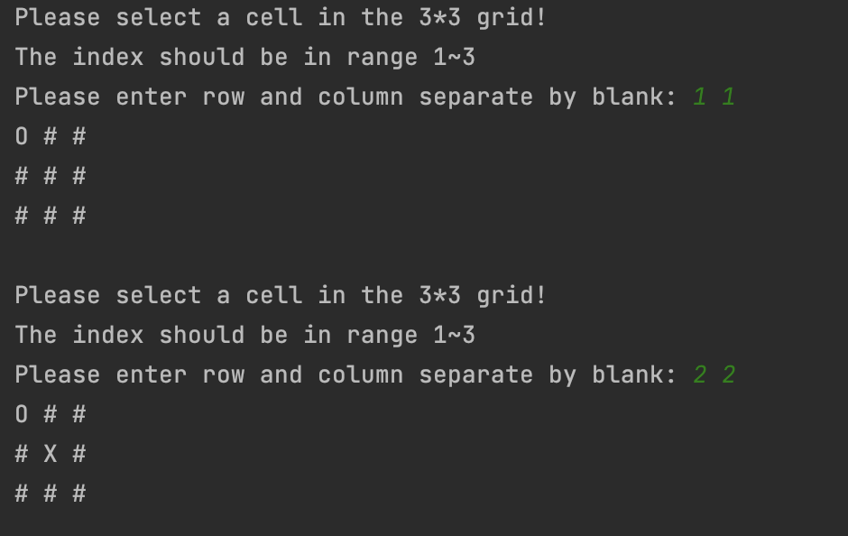
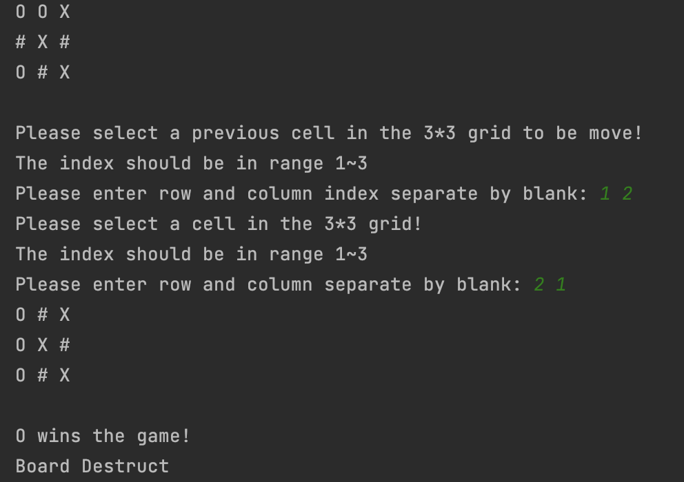

# TicTacToe with Rule

This is a C++ project that implement TicTacToe with an additional rule.

### Additional Rule
Once player place three pieces(`O` or `X`) on the board, they can't place the fourth on the board.
However, player can move an exist piece that player owns and move to an empty place.

The rest is the same.

## Game Start

## Game plays

## Move exist piece

